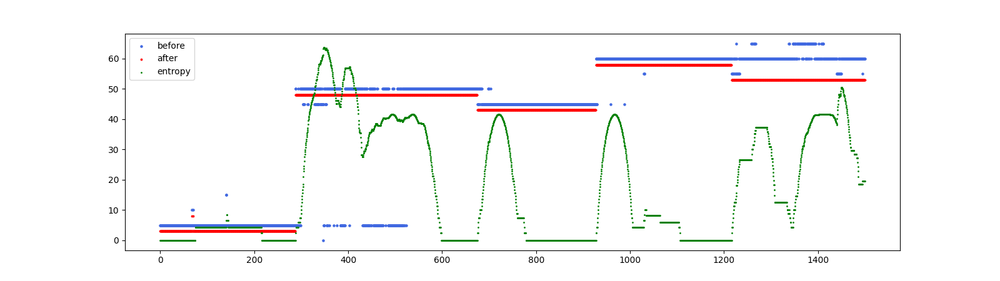

# Entropy filter

It uses entropy jumps to detect changes in the state of the system. Fluctuations usually occur in this place, so this filter only works in places where the local window entropy is not zero.

